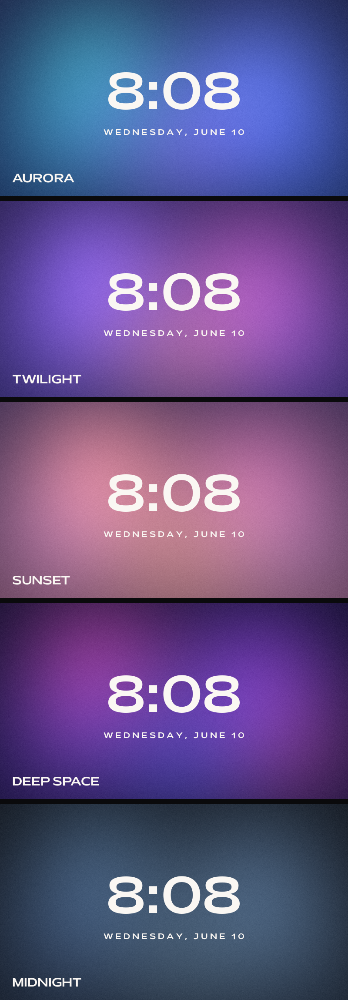

# Drift Clock

An ambient, fluid clock screensaver for Windows 10/11. Aurora-like colors flow and blend behind a minimal clock, rendered in real time on your GPU at your monitor's full refresh rate.

## Themes

1. **Aurora** — teal, periwinkle, and violet on deep navy
2. **Twilight** — violet, magenta, and warm coral
3. **Sunset** — dusty coral, rose, and amber
4. **Deep Space** — magenta and purple on near-black
5. **Midnight** — calm, desaturated blues

## Install

1. Download the zip from [Releases](../../releases) and extract it
2. Double-click `install.bat` and click **Yes** on the permission prompt
3. Type a number to pick your theme
4. In the Screen Saver Settings window that opens, select **DriftClock**, set your wait time, click **OK**

That's it. Click **Preview** in that window to see it immediately.

**Requirements:** Windows 10 or 11 with Microsoft Edge (preinstalled on both). Nothing is downloaded during install.

## Change theme

Double-click `change-theme.bat` any time. No admin needed.

## How it works

The visuals are a single HTML file with a WebGL fragment shader — five light fields drifting on crossing paths, blending where they overlap, with a liquid warp over a grain texture. A small launcher (compiled on your machine from the plain-text C# source in `install.ps1`) opens it fullscreen in Edge kiosk mode and closes it the moment you move the mouse or press a key, like any native screensaver.

Everything is auditable: the installer, theme switcher, and launcher source are plain text files in this repo. No telemetry, no network calls, no binaries shipped.

## Uninstall

1. Delete `C:\Windows\System32\DriftClock.scr` (needs admin)
2. Delete the folder `%LOCALAPPDATA%\DriftClock`

## FAQ

**Windows SmartScreen warned me.** SmartScreen flags any script downloaded from the internet. Click "More info" → "Run anyway" — or read `install.bat` and `install.ps1` in Notepad first to verify what they do.

**Black screen on first preview?** Edge takes 3–4 seconds to cold-start the first time. Subsequent launches are faster.

**The clock doesn't exit on mouse move.** Re-run `install.bat` to rebuild the launcher.

## Credits & license

Clock typeface: [Mattone](https://www.collletttivo.it/typefaces/mattone) by Nunzio Mazzaferro, published by [Collletttivo](https://www.collletttivo.it) under the SIL Open Font License 1.1 (see `FONT-LICENSE.txt`).

All screensaver code (HTML/WebGL/PowerShell/C#) is public domain. Use it, modify it, share it.
